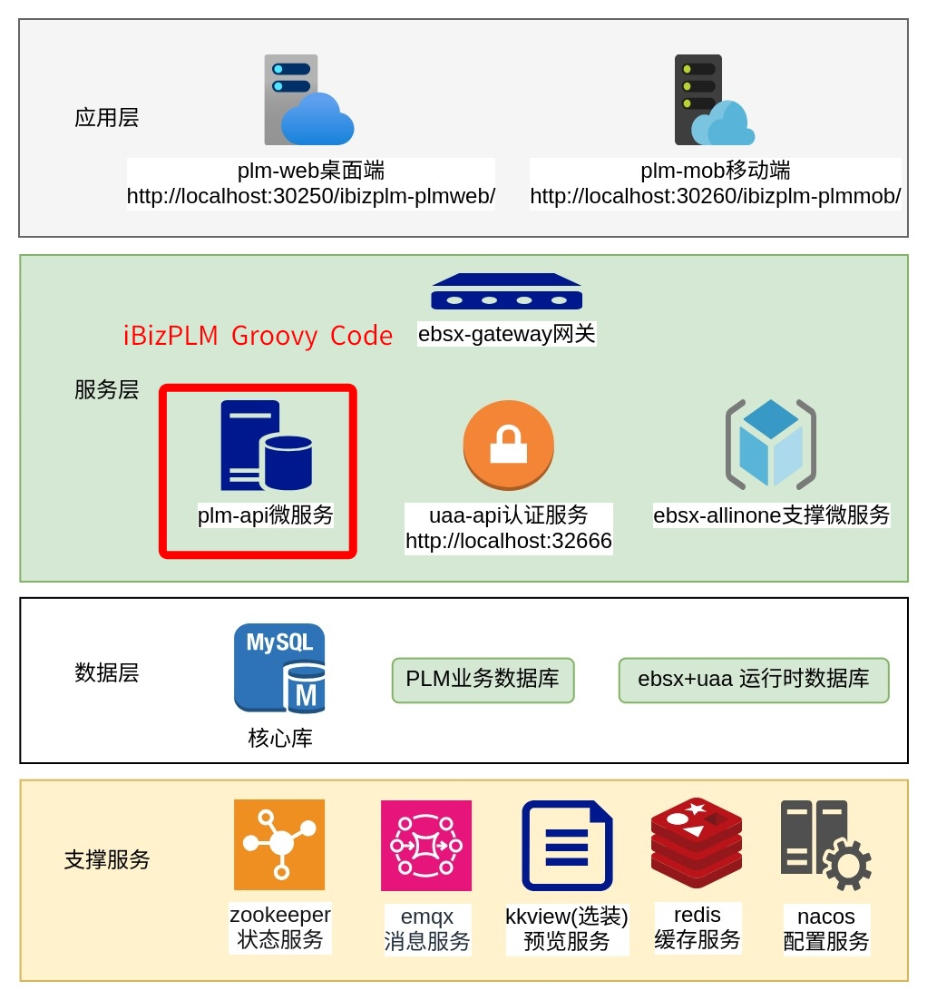
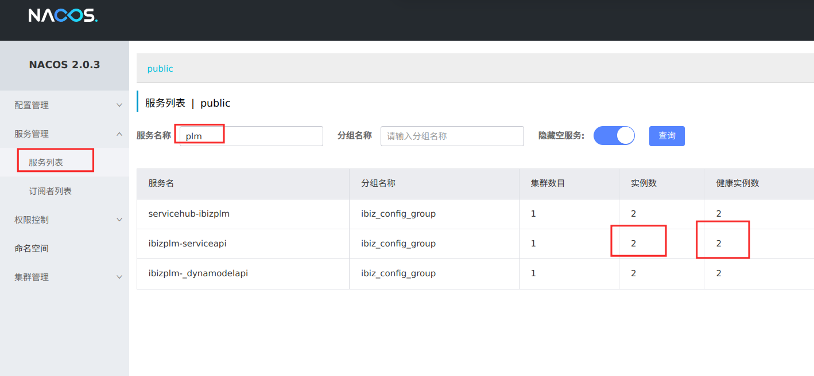
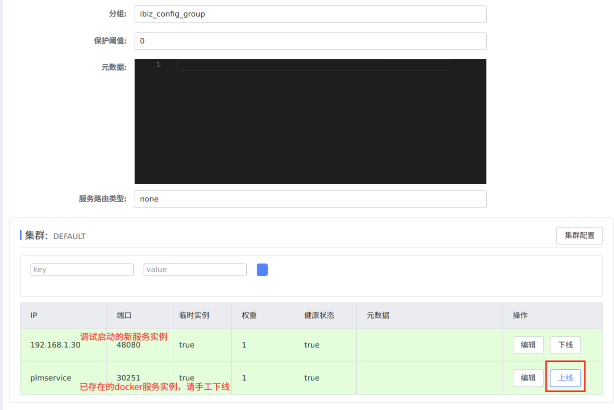
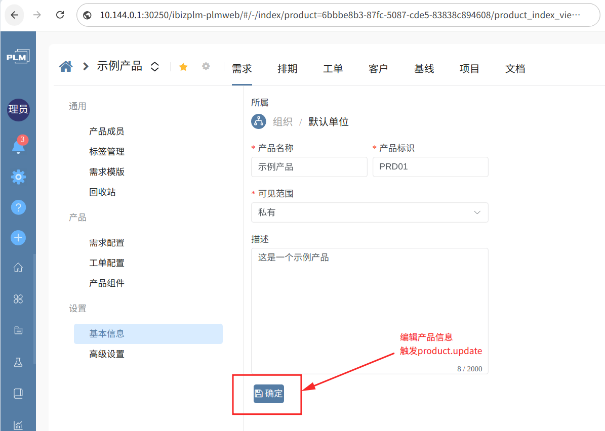
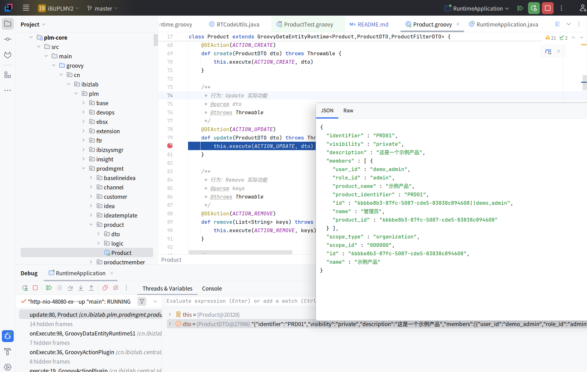

# 🌀 iBizPLM Groovy 架构项目说明

## 项目背景

本项目基于原 `plm-code (SpringBoot)` 改造而来，采用 Groovy 语言重构，将传统的 Controller/Service/Repository 模板演变为每个实体对应一个 Groovy 控制类，发布 DTO 与 Runtime 控制逻辑，底层基于以SpringBoot/SpringCloud为内核 [ibiz-service-runner](https://github.com/ibizlab-cloud/ibiz-service-hub) 引擎，该引擎来自 iBizLab 技术中台，支持全动态解释执行与插件化扩展。

通过引入 Groovy 动态语言特性，结合 `ibiz-service-runner` 动态执行引擎，极大简化了代码结构，提高了开发效率与可维护性。同时解决了 service-runner 不便调试的问题。

📢 📢 [介绍视频](https://www.bilibili.com/video/BV1sCoNYMEeV) 📢 📢



## 架构说明

### ✅ 动态控制器生成

每个实体对应一个 Groovy 控制类，无需传统 Controller/Service/Repository 分层样板代码。例如：

包路径：
```
cn.ibizlab.plm.prodmgmt.product
├── Product              ← 实体控制器（Groovy类）
└── dto/
    ├── ProductDTO       ← 数据传输对象
    └── ProductFilterDTO ← 查询过滤对象
```

### ✅ DTO 简洁链式调用

```groovy
@Test
void testSave() {
    ProductDTO dto = Product.getInstance().entity()
        .setId("test1")
        .setName("test1产品")
        .setIdentifier("0000")
        .setScopeType("organization")
        .setVisibility("public")
        .setMembers([
            new ProductMemberDTO()
                .setUserId("demo_admin")
                .setName("管理员")
                .setRoleId("admin")
        ])
        .save() as ProductDTO

    println dto
}
```

### ✅ 动态获取与查询示例

```groovy
@Test
void testGet() {
    ProductDTO dto = Product.getInstance().get("test1", true)
    if (!dto) {
        dto = Product.getInstance().create(new ProductDTO()
            .setId("test1")
            .setName("test1产品")
            .setIdentifier("0000")
            .setScopeType("organization")
            .setVisibility("public")
            .setMembers([
                new ProductMemberDTO().setUserId("demo_admin").setName("管理员").setRoleId("admin")
            ]))
        println "未命中，创建新数据: ${dto}"
    } else {
        println "命中: ${dto}"
    }
}
```

```groovy
@Test
void testFetchDefault() {
    Page<ProductDTO> page = Product.getInstance()
        .fetchDefault(new ProductFilterDTO().sort("create_time,desc"))
    println "共${page.totalPages}页，${page.totalElements}行"

    // 简写方式
    page = Product.getInstance().filter().sort("create_time,desc").fetch()
    page.content.each { println it }
}
```

## 本地IDEA

### 启动依赖项目
可通过 docker-compose 启动当前项目运行所需的 mysql、nacos、redis 等基础服务，详见[Install](https://github.com/ibizlab/plm/tree/main/deploy/compose)。

### 修改调试依赖服务域名解析地址
依赖服务均在docker网络内运行，为了本机调试时转接依赖地址，需要修改本机host域名解析，Linux或MacOS修改 /etc/hosts，Windows修改C:\Windows\System32\drivers\etc\hosts

- 将 nacos 中实例注册的短域名映射成依赖服务ip地址如:10.144.0.1

```
sudo vi /etc/hosts
```

``` 
# nacos 映射
10.144.0.1	nacos

# redis 映射
10.144.0.1	redis 
 
# 数据库 映射
10.144.0.1	mysql

# zookepr 映射
10.144.0.1	zoo1

# ibizlab-cloud云服务 映射
10.144.0.1	ibiz-ebsx-allinone

# 认证微服务 映射
10.144.0.1	ibizlab-uaa-api

# emqx 消息服务 映射
10.144.0.1	emqx
```
10.144.0.1   nacos


### 克隆此仓库

```
git clone https://github.com/ibizlab/plm-code.git
```

### 调试启动

环境要求：jdk === 1.8 
```
mvn package -Pruntime
```
#编译器中 Run 或 Debug
`plm-provider/src/main/java/cn/ibizlab/plm/RuntimeApplication.java`


出现以下界面提示说明服务器启动成功：
```
[DEBUG] n.i.central.cloud.core.ServiceHubBase    : 系统[ibizplm]已经注册
[DEBUG] n.i.central.cloud.core.ServiceHubBase    : Heap Memory Usage:
[DEBUG] n.i.central.cloud.core.ServiceHubBase    : Init: 786432000
[DEBUG] n.i.central.cloud.core.ServiceHubBase    : Used: 1489565680
[DEBUG] n.i.central.cloud.core.ServiceHubBase    : Committed: 4904714240
[DEBUG] n.i.central.cloud.core.ServiceHubBase    : Max: 11169955840
[DEBUG] n.i.central.cloud.core.ServiceHubBase    : Non-Heap Memory Usage:
[DEBUG] n.i.central.cloud.core.ServiceHubBase    : Init: 2555904
[DEBUG] n.i.central.cloud.core.ServiceHubBase    : Used: 222739928
[DEBUG] n.i.central.cloud.core.ServiceHubBase    : Committed: 231342080
```

### Nacos实例替代
启动依赖环境时，集群中已经注册有docker中启动的plmservice实例，因此我们将会看到有两个实例注册，调试服务请手工下线docker中的实例，以调试启动的实例承接网关的转发。






### 断点调试

正常访问iBizPLM的前端页面地址，本机启动的服务会正常接收到断点。





---

## 动态执行引擎：`ibiz-service-runner`

[ibiz-service-runner](https://github.com/ibizlab-cloud/ibiz-service-hub) 是基于 **iBiz 技术中台** 的全动态解释型业务引擎，具备以下核心能力：

### 🌐 全动态解释执行

- 实时解析模型文件，自动生成数据库表结构、API 接口、服务逻辑与前端 Schema。
- 支持模型热更新，无需重启服务即刻生效。

### 🧩 插件化能力扩展

- 支持通过 `ibiz-plugin` 动态加载持久化、消息队列、AI 模块等能力。
- 可通过 `ibiz-plugin-extension` 进行二次扩展与规则控制。

### ☁️ 云原生集成

- 对接 `ibiz-cloud` 中台：认证、配置中心、流程引擎。
- 内建 SaaS 多租户支持，自动处理租户隔离和资源管理。

### 🏢 企业级扩展能力

- 兼容私有协议、DevOps 流程等企业定制需求。
- 支持“云管端”混合部署模式，适配企业级部署策略。

---

## 总结

通过本次 Groovy 化改造，你可以：

- 💡 用更少的代码完成更强的业务控制逻辑；
- 🔍 更轻松地调试和运行 `ibiz-service-runner`；
- 🚀 快速上线基于模型的动态系统。

